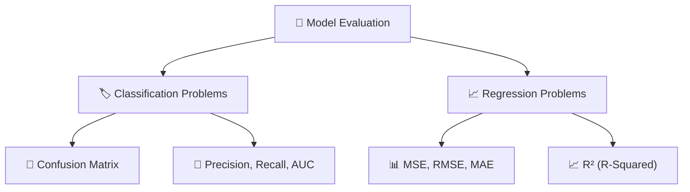

# 📚 Model Evaluation

## 🧠 **What is Model Evaluation?**

> **Definition**:  
> **Model Evaluation** measures **how good** or **bad** a machine learning model is at solving the intended problem, using the right metrics depending on whether the task is **Classification** or **Regression**.

👉 **Simply**:

- For predicting **categories** → use **classification metrics** 🏷️.
- For predicting **numbers** → use **regression metrics** 📈.

---

## 🏛️ **Evaluation Branches**

---

## 🏷️ **Classification Evaluation**

> **Classification** = Predict **which category** the data belongs to.

✅ Examples:

- Spam vs Not Spam 📧.
- Dog vs Cat 🐶🐱.

---

### 🧩 1. **`Confusion` Matrix**

✅ A table showing **correct vs incorrect predictions**:

| Actual \ Predicted | Positive               | Negative               |
| :----------------- | :--------------------- | :--------------------- |
| Positive           | True Positive (TP) ✅  | False Negative (FN) ❌ |
| Negative           | False Positive (FP) ❌ | True Negative (TN) ✅  |

---

### 🎯 2. **`Precision`, `Recall`, and `AUC`**

| Metric                     | Formula             | Best Used When                                   |
| :------------------------- | :------------------ | :----------------------------------------------- |
| Precision                  | TP / (TP + FP)      | Costly false positives (e.g., fraud detection)   |
| Recall (Sensitivity)       | TP / (TP + FN)      | Costly false negatives (e.g., medical diagnoses) |
| AUC (Area Under ROC Curve) | Area from ROC curve | Overall model quality at different thresholds    |

✅ **Quick Hints**:

- **Precision**: How "trustworthy" the positive predictions are.
- **Recall**: How "complete" the positive predictions are.
- **AUC**: How good the model is **overall**, balancing both.

---

## 📈 **Regression Evaluation**

> **Regression** = Predict a **continuous value** (number).

✅ Examples:

- Predicting house prices 🏠.
- Predicting temperatures 🌡️.

---

### 📊 1. **`MSE`, `RMSE`, `MAE`**

| Metric                    | What It Measures                                        |
| :------------------------ | :------------------------------------------------------ |
| MSE (Mean Squared Error)  | Average squared difference between actual and predicted |
| RMSE (Root MSE)           | Square root of MSE, penalizes large errors more         |
| MAE (Mean Absolute Error) | Average absolute difference (easier to interpret)       |

✅ **Quick Hints**:

- **MAE** → Easy, direct average error.
- **MSE / RMSE** → Punish bigger mistakes heavily (good if big mistakes are costly).

---

### 📈 2. **`R²` (R-Squared)**

✅ **What it does**:

- Measures **how much variance** in the target variable is **explained** by the model.

✅ **Ranges**:

| Value | Meaning                   |
| :---- | :------------------------ |
| 1.0   | Perfect model ✅          |
| 0.0   | Model explains nothing ❌ |

✅ **Quick Example**:

- R² = 0.80 ➔ 80% of score changes explained by the model (good!).

---

## ✍️ **Mini Smart Recap**

| Branch            | Metrics                                  |
| :---------------- | :--------------------------------------- |
| 🏷️ Classification | Confusion Matrix, Precision, Recall, AUC |
| 📈 Regression     | MSE, RMSE, MAE, R²                       |

✅ **Quick Tip**:

- If the task is about **labels** → Use **Classification metrics** 🏷️.
- If the task is about **numbers** → Use **Regression metrics** 📈.
