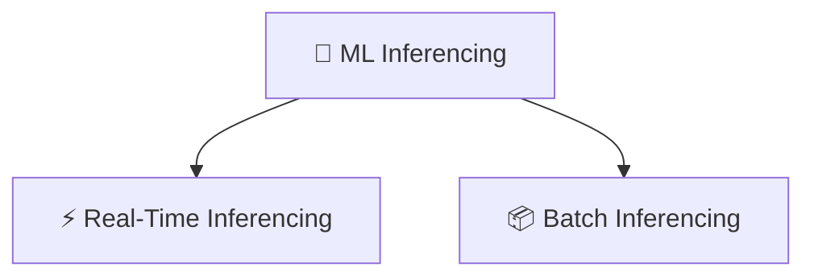
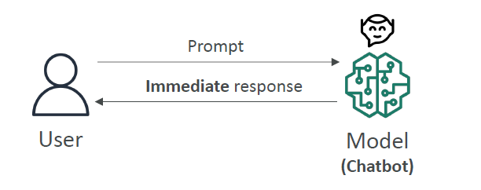
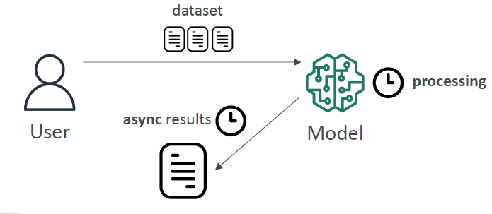
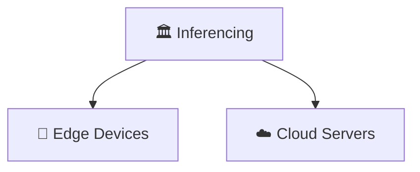
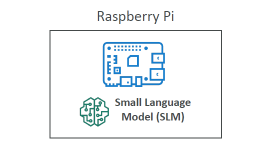
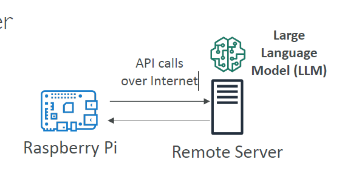

# 📚 Machine Learning — Inferencing

## 🧠 What is Inferencing in Machine Learning?

> **Definition**:  
> **Inferencing** is the process of using a **trained machine learning model** to **make predictions** on **new, unseen data**.

---

✅ **Simply**:

- **Training** is about learning patterns from data 🛠️.
- **Inferencing** is about **applying what was learned** to make decisions in real time or on new batches of data 🎯.

✅ **In Real Life**:

- Inferencing is when a chatbot answers your question 🤖.
- Inferencing is when a fraud detection system flags a suspicious transaction 💳.

---

## 🏛️ Types of Inferencing

✅ There are two main types based on **how fast** the model needs to respond:

<div style="text-align: center;">



</div>

---

### ⚡ Real-Time Inferencing

> **Definition**:  
> The model must **predict quickly** as **data arrives**.

---

<div style="text-align: center;">
    
</div>

---

✅ **Key Characteristics**:

- **Speed > Accuracy**: Faster responses are more important than perfect predictions.
- Often needs responses within **milliseconds** 🕐.
- Optimized for **low-latency** systems.

✅ **Examples**:

- Chatbots 🤖 (instant answers).
- Autonomous vehicles 🚗 (must react in real-time).
- Online recommendations (like "You might also like..." suggestions) 🛒.

✅ **Simple Flow**:

```text
User Prompt ➡️ Model ➡️ Instant Response
```

---

### 📦 Batch Inferencing

> **Definition**:  
> The model **analyzes large chunks** of data at once, not urgently.

---

<div style="text-align: center;">
    
</div>

---

✅ **Key Characteristics**:

- **Accuracy > Speed**: High-quality predictions are more important than being immediate.
- Data is **collected first**, then **processed together**.
- Often runs **periodically** (e.g., hourly, daily).

✅ **Examples**:

- Analyzing millions of customer transactions overnight 💳📊.
- Sentiment analysis of all tweets from the last 24 hours 🐦📝.

✅ **Simple Flow**:

```text
Dataset ➡️ Model ➡️ Batch Results (after processing)
```

---

## 🏗️ Where Does Inferencing Happen?

✅ Inferencing can happen either **locally (Edge Devices)** or **remotely (Cloud Servers)**:

<div style="text-align: center;">



</div>

---

### 📱 Inferencing at the Edge

> **Definition**:  
> Performing inference **directly on the device** that generates the data (e.g., a mobile, IoT device) without needing internet all the time.

---

<div style="text-align: center;">
    
</div>

---

✅ **Key Characteristics**:

- **Very low latency** (super fast ⚡).
- **Offline capability** (can work without internet 🌐).
- **Low compute power** needed.

✅ **Examples**:

- Smart cameras 🎥 recognizing faces **locally**.
- A **Raspberry Pi** running a voice assistant offline 🎤.

✅ **Typical Setup**:

- Small, optimized models (Small Language Models — **SLMs**).
- Focus on **efficiency**: models must be **tiny** and **fast**.

✅ **Simple Flow**:

```text
Device ➡️ SLM Model ➡️ Local Prediction
```

---

### ☁️ Inferencing in the Cloud (Remote Server)

> **Definition**:  
> Performing inference **on a powerful remote server** via API calls over the internet.

---

<div style="text-align: center;">
    
</div>

---

✅ **Key Characteristics**:

- **More powerful models** (like Large Language Models — **LLMs**).
- **Higher accuracy**, but **higher latency** due to internet travel time.
- Requires **internet connection**.

✅ **Examples**:

- Asking ChatGPT a question 🌐🧠.
- Submitting images to a cloud server for classification 🖼️☁️.

✅ **Typical Setup**:

- Powerful GPUs/TPUs hosted remotely.
- API calls from user devices.

✅ **Simple Flow**:

```text
Device ➡️ API Call ➡️ Remote Server ➡️ LLM Model ➡️ Response
```

---

## ✍️ Smart Mini Recap

| Type                     | Key Points                                 | Examples                       |
| :----------------------- | :----------------------------------------- | :----------------------------- |
| ⚡ Real-Time Inferencing | Fast decisions, slight accuracy sacrifice  | Chatbots, Self-driving cars    |
| 📦 Batch Inferencing     | Slower, high accuracy needed               | Overnight transaction analysis |
| 📱 Edge Inferencing      | Local device, very fast, low compute       | Raspberry Pi running local AI  |
| ☁️ Cloud Inferencing     | Remote servers, big models, needs internet | ChatGPT, Image APIs            |

✅ **Simple Tip**:

- Need **speed** ➔ **Real-time**.
- Need **deep analysis** ➔ **Batch**.
- No internet, fast ➔ **Edge**.
- Big model, lots of power ➔ **Cloud**.
