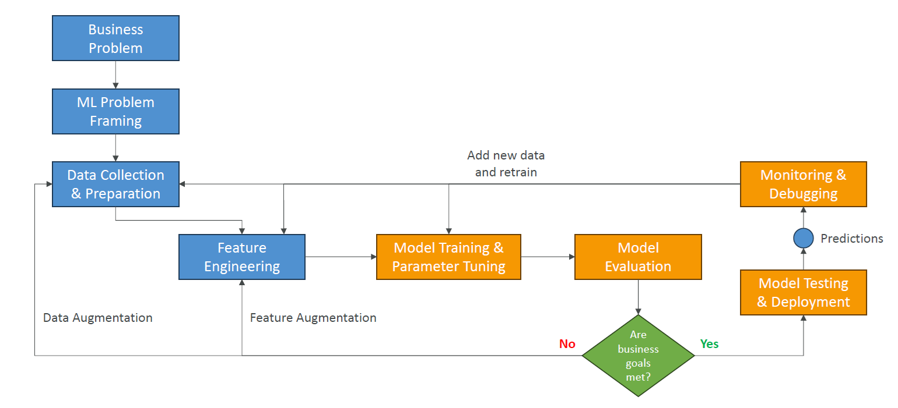

# 📚 Phases of a Machine Learning Project — From Idea to Production

## 🧠 What is a Machine Learning Project Lifecycle?

> **Definition**:  
> A **Machine Learning (ML) project** goes through a **structured series of phases** —  
> from defining the **business need**, preparing the **data**, building the **model**, deploying it into production, and then **monitoring and improving it continuously**.

---

  

---

## 🏛️ Detailed Phases of a Machine Learning Project

### 🎯 1. Define Business Goals

📌 **What happens**:

- Stakeholders define **the real-world value** the ML system should deliver.
- Set **business success criteria** (money saved, accuracy achieved, customers retained).

📌 **Key Actions**:

- Define **KPIs** (Key Performance Indicators).
- Set **budget** and **timeline**.
- Identify **who benefits** and **how success is measured**.

📌 **Example**:

- **Goal**: Reduce fraud detection time from 24 hours to 5 minutes 💳.

---

### 🧩 2. ML Problem Framing

📌 **What happens**:

- Translate the **business problem** into a **machine learning problem**.

📌 **Key Questions**:

- **Classification?** (Spam or Not Spam?)
- **Regression?** (Predict next month's revenue?)
- **Recommendation?** (Suggest movies?)
- **Clustering?** (Group similar users?)

📌 **Important**:

- Verify **if ML is even needed**.  
  (Maybe a simple rule-based solution is enough!)

📌 **Participants**:

- Data Scientists, ML Engineers, Data Engineers, Domain Experts.

📌 **Example**:

- Business Problem: "Catch fraudulent transactions."
- ML Framing: "Train a **binary classifier** on transaction data."

---

### 🧹 3. Data Collection and Preparation

📌 **What happens**:

- Gather **all relevant data**.
- **Clean**, **integrate**, and **transform** it into a **usable format**.

📌 **Sub-steps**:

- 📦 **Data Collection**: Databases, APIs, external datasets.
- 🔄 **Data Integration**: Make all data accessible in one place.
- 🧹 **Data Preprocessing**:
  - Handle missing values.
  - Normalize or scale features.
  - Encode categorical variables.
- 📊 **Data Visualization**: Explore trends, outliers, distributions.

📌 **Golden Rule**:  
**Garbage in = Garbage out.**  
Good models need **good data**!

---

### 🛠️ 4. Feature Engineering

📌 **What happens**:

- **Create**, **transform**, and **select** features that help the model learn better.

📌 **Typical Techniques**:

- Feature Creation:
  - Create new variables (e.g., time between transactions).
- Feature Transformation:
  - Log-transform skewed data.
- Feature Selection:
  - Keep only relevant features using correlation, feature importance.

📌 **Example**:

- From "Date of Birth", create "Age" ➡️ age impacts buying behavior.

📌 **Impact**:  
Feature engineering often **matters more than the choice of model** itself!

---

### 🏗️ 5. Model Training & Hyperparameter Tuning

📌 **What happens**:

- Train one or multiple models using the processed dataset.
- Tune **hyperparameters** to optimize model performance.

📌 **Important Concepts**:

- **Training Set**: Data used to teach the model.
- **Validation Set**: Data used to fine-tune hyperparameters.
- **Hyperparameters**: Settings like learning rate, number of trees, depth of a network.

📌 **Iterative**:

- Train ➡️ Validate ➡️ Tune ➡️ Repeat 🔄.

📌 **Common Algorithms**:

- Decision Trees, Random Forest, Gradient Boosting, Neural Networks, etc.

---

### 🎯 6. Model Evaluation

📌 **What happens**:

- Assess how well the model performs on **unseen data** (test set).

📌 **Metrics Used**:

- **Classification**: Precision, Recall, F1 Score, AUC-ROC.
- **Regression**: MAE, MSE, RMSE, R².

📌 **Golden Rule**:  
Evaluation should align with **business success criteria**, not just accuracy!

📌 **Example**:

- In fraud detection, **Recall** is more important than just overall accuracy.

---

### 🚀 7. Model Testing and Deployment

📌 **What happens**:

- Final checks and **launch** the model to production.

📌 **Decisions**:

- **Deployment Mode**:
  - Real-time API? ⏩
  - Batch Processing? 📦
  - Edge device deployment? 📱
- **Environment**:
  - Cloud, on-premises, serverless?

📌 **Model Testing**:

- Ensure model responds correctly in **real-world conditions**.
- Perform **canary deployments** or **A/B tests** before full rollout.

📌 **Example**:

- Chatbot response time under 2 seconds guaranteed ✅.

---

### 🛡️ 8. Monitoring and Debugging

📌 **What happens**:

- After deployment, **monitor the model continuously**.

📌 **What to Monitor**:

- Model Accuracy Drop (Concept Drift) 📉.
- Data Quality Issues.
- Latency & Response Errors.

📌 **Debugging Tools**:

- Model explainability (SHAP, LIME).
- Log analysis.

📌 **Goal**:

- Early detection of issues before they impact users.

---

### 🔄 9. Retraining and Iterations

📌 **What happens**:

- **Machine Learning is never "one and done"** ❌.

📌 **Why Retrain?**:

- User behavior changes 📈.
- New data arrives 📦.
- Business goals evolve.

📌 **Process**:

- Collect new data ➡️ Enhance features ➡️ Retrain model ➡️ Reevaluate ➡️ Redeploy.

📌 **Example**:

- A fraud detection model must be updated as new fraud strategies appear.

---

## ✍️ Mini Smart Recap

| Phase                      | Main Goal                        |
| :------------------------- | :------------------------------- |
| 🎯 Define Business Problem | Set clear, measurable goals      |
| 🧩 Frame ML Problem        | Translate to ML task             |
| 🧹 Data Preparation        | Clean, integrate, visualize data |
| 🛠️ Feature Engineering     | Build powerful features          |
| 🏗️ Model Training          | Teach models using data          |
| 🎯 Model Evaluation        | Verify model quality             |
| 🚀 Testing & Deployment    | Launch model safely              |
| 🛡️ Monitoring              | Keep models healthy              |
| 🔄 Iterations              | Improve models over time         |
