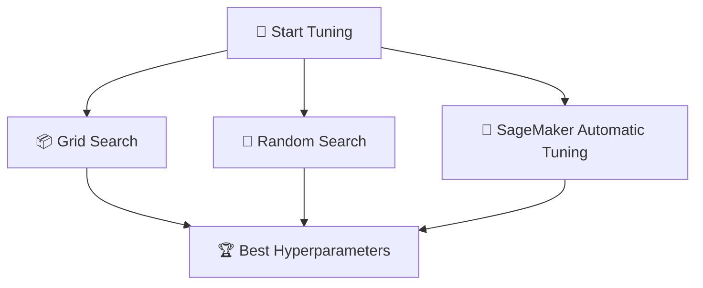

# 📚 Hyperparameters in Machine Learning — Full Smart Guide

## 🧠 What are Hyperparameters?

> **Definition**:  
> **Hyperparameters** are **settings** that control the **structure of the model** and the **learning process** —  
> they are **set before training begins** and are **not learned** from the data.

📌 **Simply**:

- Model **weights** are learned during training.
- **Hyperparameters** are **chosen manually** (or by search techniques) before training to guide learning.

---

## 🛠️ Examples of Hyperparameters

| Hyperparameter   | Meaning                                         |
| :--------------- | :---------------------------------------------- |
| Learning Rate    | How big each update step is during optimization |
| Batch Size       | How many samples are used per weight update     |
| Number of Epochs | How many full passes through the training data  |
| Regularization   | Controls complexity to avoid overfitting        |

📌 **Analogy**:  
Hyperparameters are like **the settings of your oven** before you bake 🍰:  
Temperature, Time, and Mode — if you get them wrong, even the best ingredients won’t save you!

---

## 🏗️ Important Hyperparameters Explained

### 🎯 1. Learning Rate (α)

> **Definition**:  
> How large or small the steps are when updating model weights during training.

📌 **Behavior**:

- 🔥 High Learning Rate:
  - Faster convergence ⚡.
  - Risk of overshooting optimal values ❌.
- 🐢 Low Learning Rate:
  - Slower convergence 🐌.
  - More precise approach to minimum ✅.

📌 **Formula (in updates)**:

$$
\theta = \theta - \alpha \nabla_\theta J(\theta)
$$

Where:

- ($ \theta $) are the weights,
- ($ \alpha $) is the learning rate,
- ($ J(\theta) $) is the loss function.

---

### 📦 2. Batch Size

> **Definition**:  
> The number of samples processed before the model's internal parameters (weights) are updated.

📌 **Behavior**:

- 🎯 Small Batch (e.g., 32 samples):
  - More stable learning, higher noise (can escape local minima).
  - Slower to train.
- 🛫 Large Batch (e.g., 1024 samples):
  - Faster computation.
  - Risk of converging to sharp minima (worse generalization).

📌 **Typical Values**:

- 16, 32, 64, 128, 256.

---

### 🔁 3. Number of Epochs

> **Definition**:  
> How many times the entire training dataset passes through the model.

📌 **Behavior**:

- 🚶‍♂️ Few Epochs:
  - Risk of **underfitting** (model hasn't learned enough).
- 🏃‍♂️ Too Many Epochs:
  - Risk of **overfitting** (model memorizes training data).

📌 **Tip**:

- Use **early stopping**: monitor validation loss and stop training automatically when performance starts degrading.

---

### 🛡️ 4. Regularization

> **Definition**:  
> Techniques that **penalize** model complexity to **reduce overfitting**.

📌 **Common Regularizations**:

- **L1 Regularization (Lasso)**: Encourages sparsity (zero weights).
- **L2 Regularization (Ridge)**: Discourages large weights.

📌 **Loss Function Example**:

$$
\text{Loss} = \text{Original Loss} + \lambda \sum \theta^2
$$

Where:

- ($ \lambda $) controls the strength of regularization.

📌 **Effect**:

- Higher regularization = simpler models (generalize better).

---

## 🔍 What is Hyperparameter Tuning?

> **Definition**:  
> **Hyperparameter Tuning** is the process of **finding the best set of hyperparameter values** to optimize the model's performance.

📌 **Why It Matters**:

- Correct hyperparameters can massively improve **accuracy**, **reduce overfitting**, and **enhance generalization**!

---

## 🔍 How to Do Hyperparameter Tuning?

| Method                                    | What It Does                                          |
| :---------------------------------------- | :---------------------------------------------------- |
| 📦 Grid Search                            | Try **all combinations** of hyperparameter values     |
| 🎲 Random Search                          | Try **random combinations** (faster than grid search) |
| 🤖 Automated Tuning (e.g., SageMaker AMT) | AI/ML automatically finds good combinations           |

📌 **Quick Visual**:

---

## 🛡️ What to Do if Overfitting?

📌 **Overfitting = Good on Training Data, Bad on New Data**.

📌 **Causes**:

- Model **too complex**.
- **Training data too small**.
- **Training for too many epochs**.

📌 **Solutions**:

| Problem                | Solutions                     |
| :--------------------- | :---------------------------- |
| Too Complex            | Add Regularization (L1/L2)    |
| Small Data             | Data Augmentation 📈          |
| Too Many Epochs        | Early Stopping 🔥             |
| Model Memorizing Noise | Use Dropout or Simplify Model |

📌 **Important**:

- **Adjusting hyperparameters is the safest lever** 🔧 — it doesn't change your data!

---

## ✍️ Mini Smart Recap

| Concept                   | Key Idea                                          |
| :------------------------ | :------------------------------------------------ |
| Hyperparameters           | Settings chosen before training                   |
| Tuning                    | Finding the best settings                         |
| Important Hyperparameters | Learning Rate, Batch Size, Epochs, Regularization |
| Tuning Techniques         | Grid Search, Random Search, Automatic             |
| Overfitting Fixes         | Regularization, Early Stopping, Data Augmentation |

📌 **Simple Rule**:

- **Model = Baking Cake** 🍰:
  - Hyperparameters = **Oven Settings** (Temperature, Time, Mode).

📌 **Tuning** = Finding the **perfect recipe** to get a golden, delicious model!
