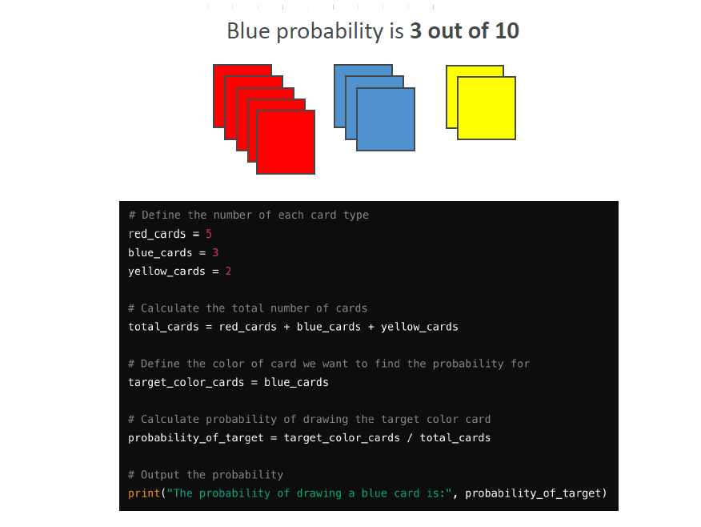
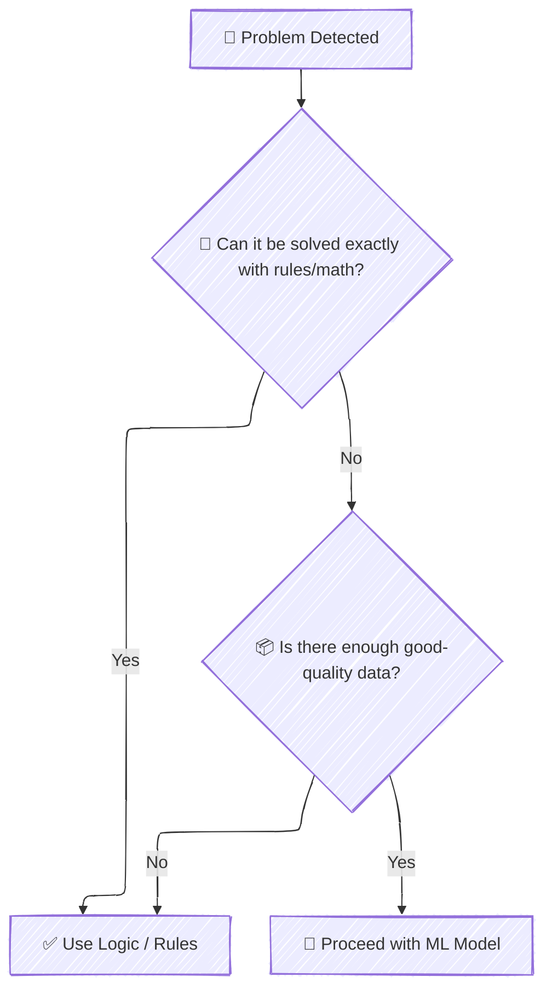

# 📚 When is Machine Learning NOT Appropriate?

## 🧠 Machine Learning is Powerful, but NOT Always Needed

> **Definition**:  
> Machine Learning (ML) shines when **patterns must be learned from data**,  
> **but it’s NOT the right tool** when a problem can be solved with **simple, deterministic logic**.

📌 **Simply**:  
If you can **calculate** the correct answer with **basic math or rules**,  
you **don’t need Machine Learning**!

📌 **Golden Rule**:

> If the problem already has a **known, fixed solution** ➔ ML will only **approximate it worse**.

---

## 🎯 Simple Example: Picking a Card

    

---

Imagine this well-defined problem:

> "A deck contains **5 red cards**, **3 blue cards**, and **2 yellow cards**.  
> What’s the probability of drawing a blue card?"

📌 Easy deterministic answer:

$$
\text{Probability of Blue} = \frac{3}{10} = 30\%
$$

📌 **Here**, using ML to "learn" this probability from data would be:

- **Slower** ❌.
- **Less accurate** ❌.
- **More resource-hungry** ❌.

📌 **Correct approach**:  
Just **calculate it directly** with math 📚.

---

## 🧩 When Machine Learning is NOT Appropriate

### 📌 **1. Deterministic Problems**

- Problems where there’s a **precise, rule-based solution** 📐.
- No need for approximation.

📌 **Examples**:

| Problem                                      | Better Approach                            |
| :------------------------------------------- | :----------------------------------------- |
| Calculating the area of a circle from radius | Use simple math formula: \( A = \pi r^2 \) |
| Finding the shortest path in a known map     | Use Dijkstra’s Algorithm 🛣️                |
| Counting votes in an election                | Summation logic                            |

---

### 📌 **2. Small / Non-representative Data**

- ML **learns from data**.
- If you have **too little data** or **bad data**, ML will:

  - Overfit 🚑.
  - Underperform 🚫.

📌 **Example**:

- Only 10 customer records ➔ Don’t build a prediction model!  
  Instead: Use basic statistics 📊.

---

### **3. Strict Real-Time Deterministic Needs**

- Some problems need **instant exact results** (no errors allowed).

📌 **Example**:

- Flight control systems ✈️ — you can't "approximate" stability!

📌 **Better Approach**:

- Use **hard-coded physics models**, not ML.

---

### **4. Problems Where Human Rules Are Better**

- Some domains are **easier to solve** by **explicitly writing rules**.

📌 **Example**:

- Validating credit card numbers → Luhn algorithm (checksum), not ML.

---

## 🛑 What Happens if You Use ML Anyway?

| Result              | Problem                                         |
| :------------------ | :---------------------------------------------- |
| Approximate answers | Instead of exact answers                        |
| Wasted resources    | Training time, compute costs                    |
| Higher risk         | Because approximation may cause wrong decisions |

📌 **Simple Logic**:
If **mathematics, algorithms, or physics** already solve the problem exactly ➔ **Don't use ML!** ❌

---

## 🧠 Quick Visual Summary

---

## ✍️ Mini Smart Recap

| Situation                                       | Solution                         |
| :---------------------------------------------- | :------------------------------- |
| Problem can be solved with math or simple logic | ✅ Use direct rules              |
| Too little or bad data                          | ❌ ML will fail                  |
| Real-time, deterministic needs                  | ✅ Use hard-coded rules          |
| Need perfect accuracy                           | ✅ Prefer rule-based programming |
