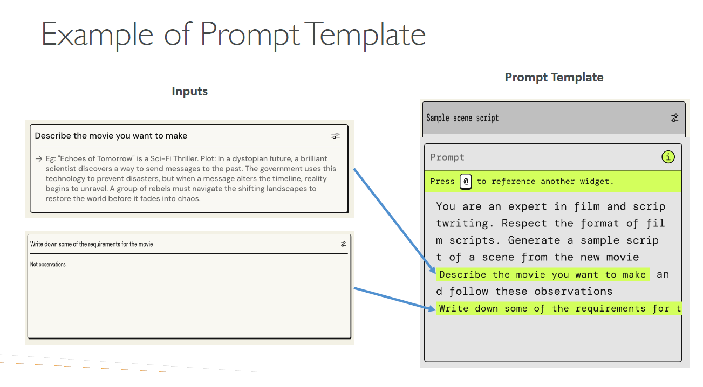

# Prompt Engineering with Amazon Bedrock

## What is Prompt Engineering?

    
    

### Negative Prompting

    
    

## How Text is generated in an LLM

    

## Prompt Performance Optimization

    
    

## Prompt Engineering Techniques

### Zero-Shot Prompting

    

### Few-Shot Prompting

    

### Chain-of-Thought Prompting

    

### RAG (Retrieval-Augmented Generation)

    

## Prompt Templates

    
    

### Prompt Template Injections

    
    

