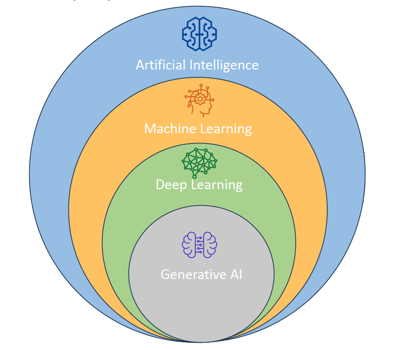
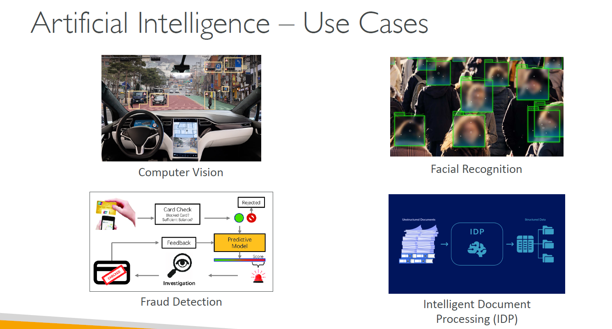
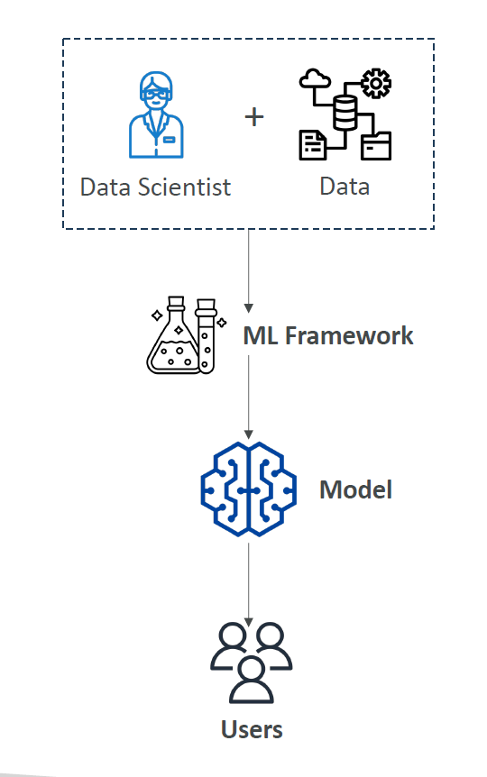
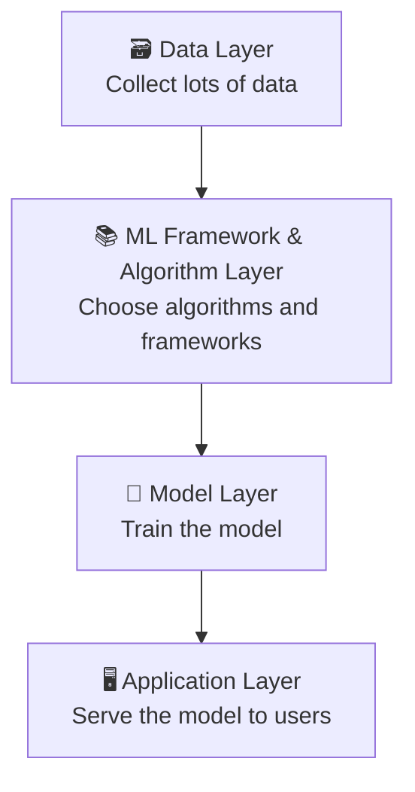

# 🤖 What is Artificial Intelligence (AI)? — Full Beginner Guide

---

## 🧠 **What is AI?**

> **Official Definition:**  
> **Artificial Intelligence (AI)** is a broad field focused on building **intelligent systems** capable of **performing tasks** that would typically require **human intelligence**.

✅ **Key Abilities AI Tries to Imitate**:

- 🧿 **Perception** → Understanding the world (like seeing with eyes, hearing with ears)
- 🧠 **Reasoning** → Making logical conclusions
- 📚 **Learning** → Getting better over time by experience
- 🛠️ **Problem Solving** → Finding solutions to complex challenges
- 🧩 **Decision-making** → Choosing between different options

---

## ☂️ **AI is an Umbrella Term**

✅ **AI** is like a big **umbrella** 🌂 covering many techniques and fields underneath it:

- Traditional Logic-based Systems
- Machine Learning
- Deep Learning
- Computer Vision
- Natural Language Processing (NLP)

**Simple analogy**:  
If **technology** is a zoo 🦁🦓🦒, then **AI** is the part where animals can **think, talk, and make decisions** 😅.

---

## 🌍 **Real-World AI Use Cases**

Let's make this more **practical**! 🚀  
Here are some powerful examples of how AI is used today:

| AI Field                                     | Example Use Case                                                                         |
| :------------------------------------------- | :--------------------------------------------------------------------------------------- |
| 🖼️ **Computer Vision**                       | Helping machines "see" and understand images and videos                                  |
| 👤 **Facial Recognition**                    | Unlocking your phone just by looking at it                                               |
| 🕵️ **Fraud Detection**                       | Banking systems detecting suspicious transactions automatically                          |
| 📑 **Intelligent Document Processing (IDP)** | AI reading documents, extracting data, and automating workflows (like scanning invoices) |

✅ **Notice:**  
AI is **already everywhere** in your life — banking apps, e-commerce recommendations, security systems, even your phone camera's "portrait mode"!

---

    

---

## 🏗️ **AI Architecture: The 4 Major Components**

Imagine AI as a **big building project**. Each component is like a department helping to build the intelligent system 🏢:

### 1. 🗃️ Data Layer

> **What it is:**  
> The **foundation**.  
> We collect **huge amounts of data** — text, images, clicks, sensor signals — anything that helps train AI.

✅ Example:  
Thousands of cat pictures to teach AI what a "cat" looks like 🐱.

---

### 2. 📚 ML Framework and Algorithm Layer

> **What it is:**  
> The **brainstorming and toolbox** department.  
> Data Scientists and Engineers work together to:

- Understand the **use case** (What problem are we solving?)
- Choose **frameworks** (like TensorFlow, PyTorch)
- Select **algorithms** (like Decision Trees, Neural Networks) to solve the problem.

✅ Example:  
Choosing whether to use a simple **linear regression** or a **deep learning model** to predict house prices.

---

### 3. 🧩 Model Layer

> **What it is:**  
> The **actual machine brain** we build and train.

This involves:

- Defining the **structure** (how many layers, neurons, connections)
- Setting **parameters** (weights, biases)
- Applying an **optimizer function** (like Gradient Descent) to improve accuracy over time.

✅ Example:  
Training a neural network to recognize handwritten numbers (like 5️⃣ vs 8️⃣).

---

### 4. 🖥️ Application Layer

> **What it is:**  
> The **final product** the user interacts with!  
> How we **serve** the trained model in real applications.

✅ Example:

- A web app that can detect if a face matches your ID 📸
- A chatbot answering your questions 🤖

---

## 🔥 **Visual Summary: AI Components**

    

---

---

## 🎯 **Quick 3 Question Practice!**

| Question                                              | Your Answer                                                         |
| :---------------------------------------------------- | :------------------------------------------------------------------ |
| What are the 5 key human tasks AI tries to replicate? | (Perception, Reasoning, Learning, Problem solving, Decision-making) |
| Which layer involves serving the AI model to users?   | (Application Layer)                                                 |
| Is AI only about Machine Learning?                    | (No, ML is a **subset** of AI!)                                     |

---

## 🛣️ **What's Next?**

👉 If you want, we can continue to the next detailed topic:  
🔜 **"Machine Learning vs Traditional Programming"** — where you'll deeply understand **why ML is different**, and **what actually changes** behind the scenes!

---

Would you like me to continue directly to that topic now? 🚀 (It will be even more fun and deep!) 🔥  
**Just say GO!** 🎯
