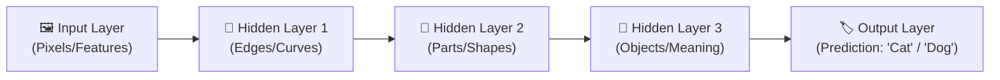
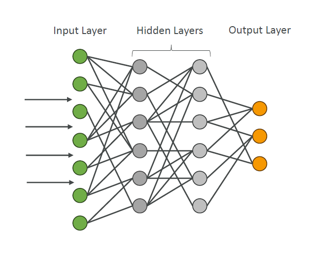

# 🧠 What is Deep Learning (DL)?

## 🧠 **What is Deep Learning (DL)?**

> **Official Definition:**  
> **Deep Learning (DL)** is a **type of Machine Learning** that uses **artificial neurons and synapses** (inspired by our brain) to **learn complex patterns** from massive amounts of data.

✅ **Key Points**:

- DL is **brain-inspired** 🧠 — uses **neurons** and **synapses**.
- Processes **more complex** data patterns than traditional ML.
- Called "**Deep**" because it uses **multiple layers** stacked together.
- Needs **large datasets** 📦 and **high computational power** ⚡ (hello GPUs! 👋).

---

## 🧩 **Why "Deep" Learning?**

✅ **"Deep"** means **many layers** (not just one or two).

Each layer **learns something different**:

- Early layers learn **simple things** (lines, curves).
- Deeper layers learn **complex things** (faces, objects, meanings).

✅ **Simple Analogy**:  
Think of a detective 🕵️‍♂️ solving a case step-by-step:

- First, recognize fingerprints (simple pattern).
- Then, recognize suspects (complex identity).

---

## 🌍 **Real-World Deep Learning Examples**

| Field                                    | Example Use Case                                                                                                                                                                 |
| :--------------------------------------- | :------------------------------------------------------------------------------------------------------------------------------------------------------------------------------- |
| 🖼️ **Computer Vision**                   | - Image Classification (Is it a cat or dog?) - Object Detection (Where’s the car in the photo?) - Image Segmentation (Which pixels belong to a human?)                     |
| ✍️ **Natural Language Processing (NLP)** | - Text Classification (Is this email spam?) - Sentiment Analysis (Is this review positive?) - Machine Translation (English → French) - Language Generation (ChatGPT 😁) |

✅ **Notice**:  
DL powers modern breakthroughs like **self-driving cars**, **real-time translation apps**, **chatbots**, and **image generators**!

---

## ⚙️ **How Neural Networks Work (in Deep Learning)**

Imagine an army of tiny **brain cells** (nodes) all working together 🧠✨

✅ **Neural Network Basic Structure**:

- **Nodes**: Tiny units that process information.
- **Connections**: Links between nodes (like synapses).
- **Layers**:
  - **Input Layer** → Where data enters.
  - **Hidden Layers** → Where magic happens (pattern learning!).
  - **Output Layer** → Final answer or prediction.

✅ **How it works** (in simple terms):

1. Data enters the **Input Layer**.
2. It moves through **Hidden Layers**, where each node:
   - **Passes on important signals** 📢
   - **Blocks unimportant ones** 🙈
3. Final decision/output comes from the **Output Layer**.

✅ **Nodes "talk" to each other** 🎙️:

- They pass data forward based on learned **weights** and **biases**.
- As the model sees more examples, it **adjusts** the strength of these connections.

---

## 🔥 **Visual: How Neural Networks Flow**

✅ **Each layer** is like a **level-up**:

- Basic → Intermediate → Advanced features.

---

  

---

## 🏛️ **Deep Learning Example: Recognizing Handwritten Digits**

Let's apply this to something real and intuitive: **Recognizing handwritten numbers**! ✍️

✅ Here's how it works:

- **Input Layer**: Raw pixels from an image of a digit.
- **Hidden Layers**:
  - Early layers detect **lines** (good for numbers like "1", "7").
  - Middle layers detect **curves** (good for numbers like "6", "8", "9").
  - Deep layers detect **patterns** like circles, angles.
- **Output Layer**: Model predicts which digit (0-9) it thinks it sees.

✅ **Summary in Simple English**:  
Deep Learning doesn't "see numbers" like humans.  
It **sees lines, curves, and shapes** — and **learns** that certain combinations mean "Ah, that's a 6!" 🎯

---

## 📈 **Why Deep Learning Needs More Power**

✅ **Large Amounts of Input Data**:

- Neural Networks are **hungry** — they **learn better** the more data you feed them!

✅ **Needs GPUs**:

- **Graphical Processing Units (GPUs)** can process **thousands of operations in parallel**.
- Perfect for the heavy **matrix math** that deep learning models need.

✅ **Think about it**:  
Training a deep learning model without a GPU would feel like **trying to fly to the moon using a bicycle** 🚲🌕 (good luck with that 😅).

---

## ✍️ **Mini Recap!**

| Question                                       | Quick Answer                               |
| :--------------------------------------------- | :----------------------------------------- |
| What biological system inspires Deep Learning? | The human brain (neurons and synapses)     |
| Why is it called "Deep"?                       | Many layers of learning                    |
| Example of Computer Vision task?               | Image classification or object detection   |
| Why do we need GPUs?                           | To handle massive matrix calculations fast |

---

## 🛣️ What’s Next?

👉 If you want, next we can dive deeper into:  
🔜 **"Inside Neural Networks: Activation Functions, Forward and Backward Propagation"** —  
**where we open the black box** and see **how learning really happens inside** these networks! 🤯
