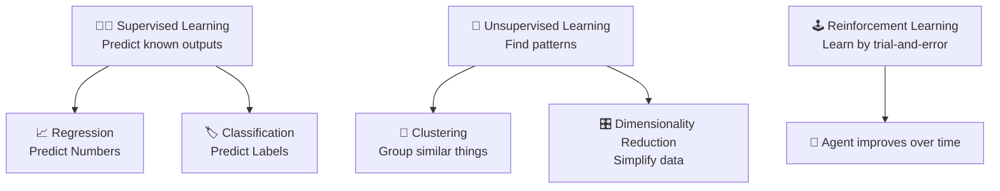

# 📚 Introduction to Machine Learning (ML) Algorithms

## 🧠 What Are ML Algorithms?

> **Official Definition**:  
> **Machine Learning (ML) algorithms** are **mathematical models** or **programming methods** that allow computers to **learn patterns from data** and **make predictions** or **decisions** without being explicitly programmed for every situation.

✅ **In simpler words**:  
ML algorithms are **smart recipes** 🧑‍🍳 —  
They **learn** from examples and **decide** things on their own without us writing "if-then" rules.

✅ **Simple Analogy**:  
Imagine training a dog 🐶:

- You don't tell it how to catch a ball step-by-step.
- You throw the ball a few times → It **learns**.

---

## 🌟 Why Do We Need ML Algorithms?

✅ **Because**:

- Real-world problems are **too complex** to hand-code.
- **Patterns** are hidden inside **huge mountains of data** 📚.
- Machines can **adapt** over time and **get smarter** without rewriting code!

✅ **Example**:

- Instead of coding "if email contains 'free money' then spam,"  
  we train a model with **examples** and it **figures out spam patterns itself** 📧.

---

## 🏛️ Types of ML Algorithms

Machine Learning algorithms are generally **grouped into categories** based on **what kind of learning they perform**.

---

### 1. 🧑‍🏫 Supervised Learning

> Learn **with a teacher** (the data is labeled).

✅ **Goal**:  
Predict an **output** based on **input**.

✅ **Common Algorithms**:

- **Linear Regression** ➡️ Predict numbers (e.g., house prices 🏠).
- **Logistic Regression** ➡️ Predict classes (e.g., spam or not 📧).
- **Decision Trees** ➡️ Simple "yes/no" question trees 🌳.
- **Support Vector Machines (SVM)** ➡️ Find the best separation line 🛡️.
- **K-Nearest Neighbors (KNN)** ➡️ Look at your closest neighbors 🤝.

✅ **Example**:

| Input (Hours Studied) | Output (Passed/Failed) |
| :-------------------- | :--------------------- |
| 5 hours               | Passed                 |
| 1 hour                | Failed                 |

Model **learns** the pattern: "More study → More likely to pass" 📈.

---

### 2. 🧠 Unsupervised Learning

> Learn **without a teacher** (no labels).

✅ **Goal**:  
Find **hidden patterns** or **groupings** in data.

✅ **Common Algorithms**:

- **K-Means Clustering** ➡️ Group similar things 🏘️.
- **Hierarchical Clustering** ➡️ Build a tree of clusters 🌲.
- **Principal Component Analysis (PCA)** ➡️ Reduce data complexity 🎛️.

✅ **Example**:

- Clustering customers based on shopping habits 🛍️ (even if you don't know anything about them yet).

---

### 3. 🕹️ Reinforcement Learning

> Learn **through rewards and punishments** 🎯.
>
> Reinforcement Learning (RL) is a type of Machine Learning where an agent learns to make decisions by interacting with an environment to achieve a goal.

✅ **Goal**:  
Maximize the total reward by learning the best sequence of actions (called a policy) that leads to the desired result.

✅ **Common Algorithms**:

- **Q-Learning** ➡️ Learn value of actions over time.
- **Deep Q Networks (DQN)** ➡️ Combine Q-learning with neural networks 🧠.

✅ **Example**:

- Imagine training a robot to navigate a maze. Each correct move toward the exit earns it a reward ✅, while hitting a wall results in a penalty ❌. Over time, the robot learns the optimal path. 🗺️:

✅ **Key concepts**:

1. **Agent**: The decision-maker.
2. **Environment**: The system the agent interacts with.
3. **Actions**: Choices available to the agent.
4. **Rewards**: Feedback indicating success or failure.

✅ **Use Cases**:

Reinforcement Learning is used in robotics, gaming (like AlphaGo), recommendation systems, and more. Would you like to dive into specific RL algorithms like Q-learning or Deep Q-Networks?

## 📈 Visual Summary: Types of ML Algorithms

---

## 🔥 Most Famous ML Algorithms at a Glance

| Algorithm           | Learning Type | Quick Purpose                       |
| :------------------ | :------------ | :---------------------------------- |
| Linear Regression   | Supervised    | Predict continuous values           |
| Logistic Regression | Supervised    | Predict categories                  |
| Decision Trees      | Supervised    | Predict decisions through questions |
| KNN                 | Supervised    | Classify by neighbors               |
| SVM                 | Supervised    | Find best separator                 |
| K-Means             | Unsupervised  | Group similar data                  |
| PCA                 | Unsupervised  | Reduce data dimensions              |
| Q-Learning          | Reinforcement | Learn optimal actions               |

---

## ✍️ Mini Smart Recap

✅ **If Data is labeled** → **Supervised Learning** 🧑‍🏫  
✅ **If Data is unlabeled** → **Unsupervised Learning** 🧠  
✅ **If Model acts and learns from rewards** → **Reinforcement Learning** 🕹️

---

## 🎯 Easy Real-Life Matching

| Real-Life Problem               | ML Approach                 |
| :------------------------------ | :-------------------------- |
| Predict stock prices 📈         | Regression (Supervised)     |
| Detect spam emails 📧           | Classification (Supervised) |
| Group news articles by topic 📰 | Clustering (Unsupervised)   |
| Train a game AI 🕹️              | Reinforcement Learning      |
