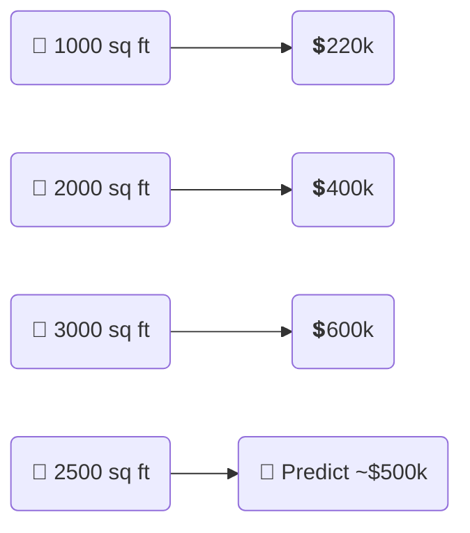
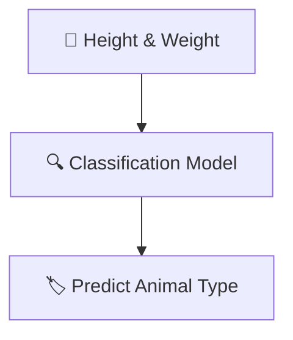

# 📚 ML Algorithms – Supervised Learning — Complete Beginner-to-Advanced Guide

## 🧠 What is Supervised Learning?

> **Official Definition**:  
> **Supervised Learning** is a type of Machine Learning where the model learns to **map inputs to outputs** using **labeled data** (data where the correct answer is known).

✅ **In simpler words**:  
Supervised Learning is like **teaching a child with flashcards** 📚:

- "This picture is a cat 🐱, this one is a dog 🐶."
- Over time, they **learn to predict correctly** when seeing new pictures!

✅ **Key Characteristics**:

- Needs **labeled** examples ✅.
- Predicts either a **value** (Regression) or a **category** (Classification).

✅ **Simple Formula**:

```text
Input ➡️ Model ➡️ Predicted Output
```

---

## 🌟 Why is it Powerful?

✅ Models **learn from examples** and **generalize** to unseen data.  
✅ Widely used in real-world tasks like fraud detection, diagnostics, customer churn prediction, etc.

**But...**

- **Collecting and labeling millions of datapoints** can be **very expensive and slow** 💸🕰️.

---

## 🏛️ Two Main Types of Supervised Learning

---

### 1. 📈 Supervised Learning — Regression

> **Definition**:  
> Regression is about **predicting a continuous numeric value** based on input features.

✅ **Key Points**:

- Output is **continuous** (can take any real value 📈).
- Goal: **Estimate quantities**.

✅ **Real-world Use Cases**:

- Predict **house prices** 🏠 based on size, location.
- Predict **stock prices** 📈 based on previous trends.
- Predict **temperature** 🌡️ based on weather history.

✅ **Example**:

| House Size (sq ft) | Price (\$) |
| :----------------- | :--------- |
| 1000               | 220k       |
| 2000               | 400k       |
| 3000               | 600k       |

➡️ Model learns the pattern and predicts:  
**House Size = 2500 sq ft** → **Predicted Price ≈ 500k** 🏡💰

✅ **Simple Visualization**:



---

### 2. 🏷️ Supervised Learning — Classification

> **Definition**:  
> Classification is about **predicting a discrete category or label** based on input features.

✅ **Key Points**:

- Output is **categorical** (distinct groups or classes).
- Goal: **Assign the right class**.

✅ **Real-world Use Cases**:

- **Email spam detection** 📧 (Spam / Not Spam).
- **Animal classification** 🐶🐱🐯.
- **Customer churn prediction** (Will leave / Will stay).

✅ **Example**:

| Animal Height | Weight | Predicted Animal |
| :------------ | :----- | :--------------- |
| 4.5 m         | 800 kg | Giraffe 🦒       |
| 0.3 m         | 5 kg   | Cat 🐱           |

➡️ Model learns:  
**Tall + Heavy = Giraffe** | **Small + Light = Cat**.

✅ **Simple Visualization**:



✅ **Special Types of Classification**:

- **Binary Classification** → 2 classes (Spam vs Not Spam).
- **Multiclass Classification** → Many classes (Dog, Cat, Giraffe).
- **Multi-label Classification** → Multiple tags at once (Movie: Action + Comedy 🎥😂).

---

## 🏗️ How Supervised Learning is Trained

Supervised learning needs the data **split into 3 sets**:

| Set               | Purpose                                        | Typical Size |
| :---------------- | :--------------------------------------------- | :----------- |
| 📚 Training Set   | Teach the model (learn patterns)               | 60-80%       |
| 🛠️ Validation Set | Tune settings (hyperparameters)                | 10-20%       |
| 🧪 Test Set       | Final evaluation (never seen by model before!) | 10-20%       |

✅ **Simple Example**:

- 1000 labeled images:
  - 800 images → Training
  - 100 images → Validation
  - 100 images → Test

✅ **Simple Visualization**:

```mermaid
flowchart LR
    FullDataset[📦 Full Dataset (100%)] --> TrainingSet[📚 Training Set (60-80%)]
    FullDataset --> ValidationSet[🛠️ Validation Set (10-20%)]
    FullDataset --> TestSet[🧪 Test Set (10-20%)]
```

---

## 🎛️ Feature Engineering — Supervised Learning's Best Friend

---

### 🧠 What is Feature Engineering?

> **Definition**:  
> Feature Engineering is the art of **transforming raw data** into **useful features** that make Machine Learning models smarter.

✅ **Why it matters**:

- Good features = Better model performance 🔥.
- Bad features = Garbage output 🗑️.

✅ **Three Major Techniques**:

| Technique              | Meaning                      | Example                                 |
| :--------------------- | :--------------------------- | :-------------------------------------- |
| Feature Extraction     | Derive new features          | Birthdate → Age                         |
| Feature Selection      | Keep only important features | Keep "house size" but drop "owner name" |
| Feature Transformation | Change format/scale          | Normalize price to 0-1 range            |

✅ **Simple Example** (House Price Prediction):

- Extract "price per square foot" 💰/📏.
- Select important features like "location" and "size" 🏠.
- Normalize prices to improve convergence speed 📉.

---

## 📊 Feature Engineering on Structured vs Unstructured Data

---

### 📊 Structured Data (Tables)

✅ **Example**:

Predict house prices based on:

| House Size | Bedrooms | Location | Price |
| :--------- | :------- | :------- | :---- |
| 1000 sq ft | 3        | Central  | 500k  |
| 2000 sq ft | 4        | Central  | 800k  |

✅ **Feature Engineering Tasks**:

- Feature Creation → "Price per Bedroom" 📊.
- Feature Selection → Drop less useful fields like "Seller's Name" 🙅‍♂️.
- Feature Normalization → Scale size/price values.

---

### 🎨 Unstructured Data (Text, Images)

✅ **Example**:

- **Text**: Customer Reviews 📝.
- **Images**: Product Photos 📸.

✅ **Feature Engineering Tasks**:

- **Text** → Convert to numbers using:
  - **TF-IDF** (word importance)
  - **Word Embeddings** (word meaning)
- **Image** → Detect features like edges or textures using:
  - **Convolutional Neural Networks (CNNs)**.

---

## ✍️ Smart Mini Recap

✅ **Supervised Learning = Learning with a teacher** 🧑‍🏫  
✅ **Regression** = Predict continuous values 📈  
✅ **Classification** = Predict categories 🏷️  
✅ **Feature Engineering** = Boost model intelligence ⚡  
✅ **Train / Validate / Test** = Fair learning process 🧪
