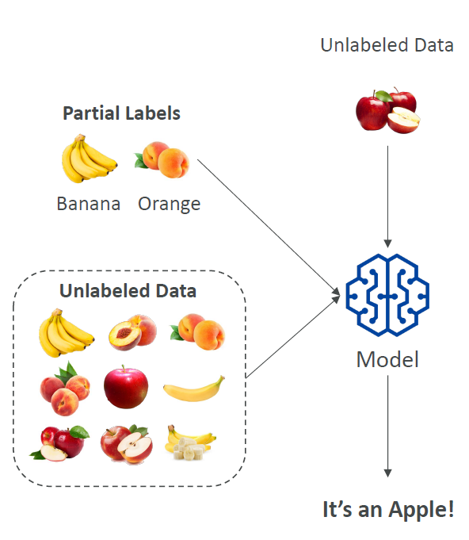
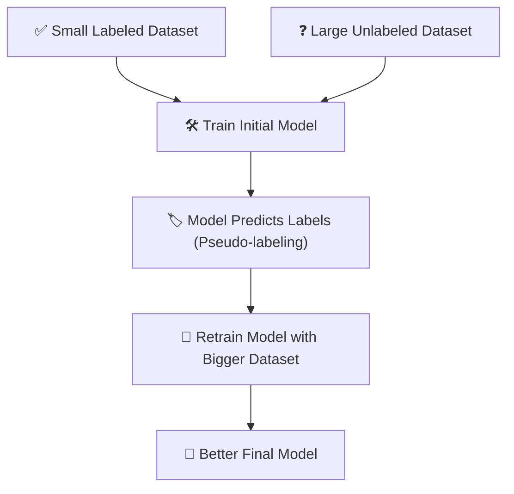

# 📚 Semi-supervised Learning — The Best of Both Worlds

## 🧠 What is Semi-supervised Learning?

> **Official Definition**:  
> **Semi-supervised Learning** is a type of Machine Learning where models are trained using a **small amount of labeled data** combined with a **large amount of unlabeled data**.  
> The model **learns from both**, initially with help, then eventually **labels the data itself** (pseudo-labeling).

---

<div style="text-align: center;">
    
</div>

---

📌 **In simpler words**:  
It’s like **teaching a smart kid with only a few answers**, and then the kid **figures out the rest on their own**! 🧑‍🎓✨

📌 **Key Characteristics**:

- Needs **few labeled examples** ✅ + **lots of unlabeled examples** ❓.
- **Learns more efficiently** than using labeled data alone.
- Uses a technique called **pseudo-labeling** to bootstrap itself.

📌 **Simple Formula**:

```text
Few labeled data + Lots of unlabeled data ➡️ Semi-supervised training ➡️ Smarter Model
```

---

## 🌟 Why Do We Need Semi-supervised Learning?

📌 **Because**:

- Labeling data manually is **slow**, **expensive**, and **boring** 🕰️💸.
- In many industries (medical, legal, etc.), **experts are needed** to label → huge cost.
- Machines can **learn efficiently** even with very few labels if guided well.

📌 **Real-world scenarios**:

- Medical imaging 🧠 (few diagnosed scans + many undiagnosed scans).
- Speech recognition 🎤 (few transcribed audios + many raw audios).
- Fraud detection 💳 (few labeled frauds + many transactions).

---

## 🏗️ How Does Semi-supervised Learning Work?

<div style="text-align: center;">



</div>

---

## 🧩 Key Concept: What is Pseudo-labeling?

📌 **Pseudo-labeling** is when the **partially trained model guesses labels** for the unlabeled data.

📌 Then it **treats these guesses as if they were real labels** for further training! 📚

📌 **Simple Analogy**:

- A student knows 10 answers.
- Then guesses 90 other answers.
- Gets feedback and **keeps improving**!

---

## 🍌🍊 Example: Fruit Classification (Simple)

Imagine you want to classify fruits 🍌🍊🍏, but you only have **few labeled examples**:

| Fruit                   | Label |
| :---------------------- | :---- |
| Banana                  | 🍌    |
| Orange                  | 🍊    |
| (many unlabeled fruits) | ❓    |

📌 **Process**:

1. Train initial model on banana and orange examples.
2. Model guesses:
   - "This unlabeled fruit is an apple 🍏!"
3. Add the guessed labels back to the training data.
4. Retrain the model for better accuracy!

---

## 🔥 Advantages of Semi-supervised Learning

| Advantage      | Why It Matters                                 |
| :------------- | :--------------------------------------------- |
| Cost-effective | Fewer labels = lower labeling costs 💰         |
| Scalability    | Can leverage millions of unlabeled examples 📈 |
| Efficiency     | Learns faster when labeled data is limited 🧠  |

---

## ⚡ Challenges in Semi-supervised Learning

| Challenge            | Why It’s Hard                                        |
| :------------------- | :--------------------------------------------------- |
| Pseudo-label errors  | If early guesses are wrong, errors can snowball ❗   |
| Data imbalance       | Too few labeled examples can still bias the model 🔄 |
| Noisy unlabeled data | Garbage unlabeled data = confusion 🗑️                |

---

## 🎯 Where Semi-supervised Learning Shines

📌 **Healthcare** 🏥:

- Few labeled scans + many raw scans = diagnose faster!

📌 **E-commerce** 🛒:

- Few product reviews labeled + lots of raw reviews = better recommendation engines!

📌 **Finance** 💳:

- Few fraudulent transactions labeled + huge bulk of normal ones = better fraud detection!

---

## ✍️ Mini Smart Recap

✅ **Semi-supervised Learning** = Few labels + Many unlabels → Smarter models 🚀.  
✅ **Pseudo-labeling** = Model labels unknown data itself 🏷️.  
✅ **Great for**: When labeled data is **scarce and expensive** 🧠💸.
