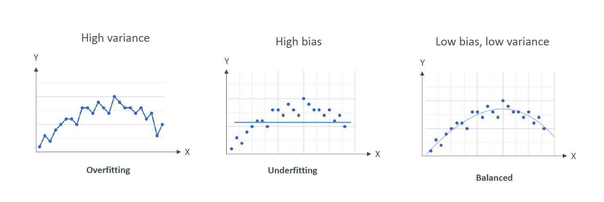
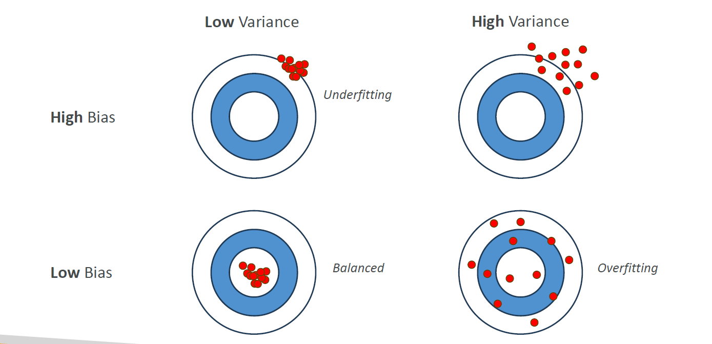
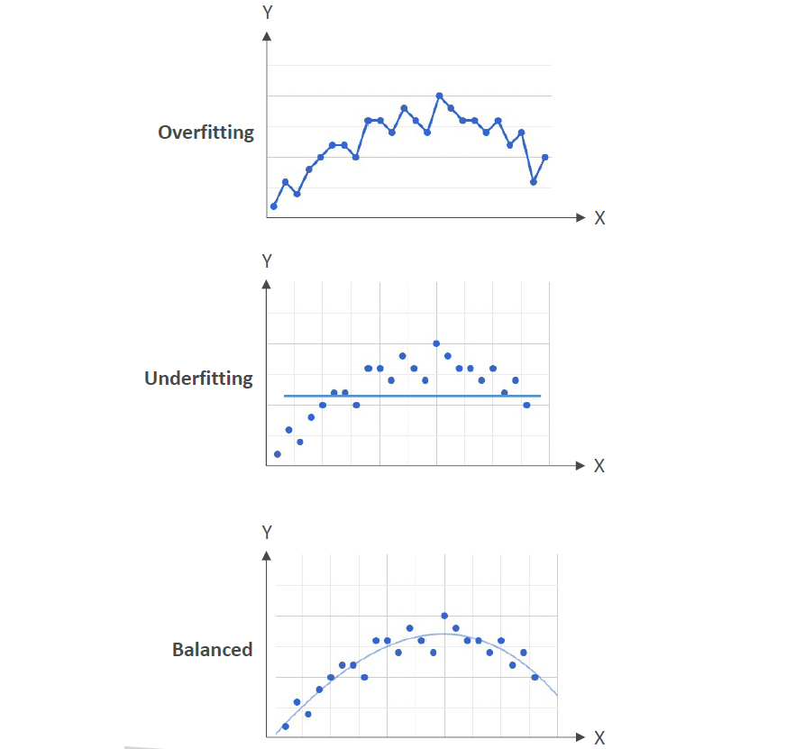
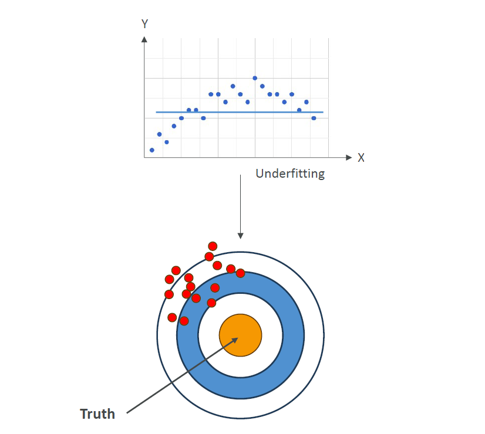
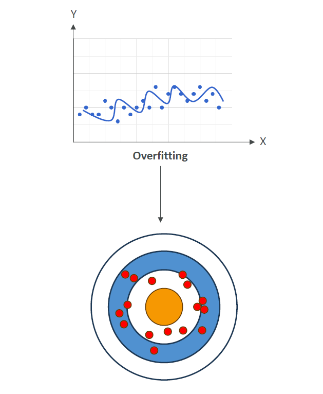

# 📚 Model Fit, Bias, and Variance

    

---

    

---

## 🧠 What is Model Fit?

> **Definition**:  
> **Model Fit** describes **how well a machine learning model captures the patterns** in the training data and **how well it generalizes** to unseen (new) data.

✅ **In simpler words**:

- Good Fit → **Understands training data** and **predicts new data well** 🎯.
- Poor Fit → **Either too simple or too memorized** — bad predictions on new data.

✅ **Three possible cases**:

| Case            | Description                                           |
| :-------------- | :---------------------------------------------------- |
| 🎯 Balanced Fit | The model generalizes well (ideal)                    |
| 🔥 Overfitting  | Model learns training data too much (bad on new data) |
| 🥶 Underfitting | Model fails to learn even the training data           |

---

### 🧩 Overfitting vs Underfitting

    

---

| Term            | Meaning                                                                              |
| :-------------- | :----------------------------------------------------------------------------------- |
| 🔥 Overfitting  | Model fits training data **too closely**, memorizing noise, fails to generalize      |
| 🥶 Underfitting | Model is **too simple**, cannot capture important patterns, fails on both train/test |

✅ **How to spot them**:

- Overfitting ➡️ High training accuracy, low test accuracy.
- Underfitting ➡️ Low training accuracy AND low test accuracy.

✅ **Simple Visual Concept**:

- Overfitting → Overcomplicating a curve to match every single point.
- Underfitting → Drawing a straight line when the real pattern is a curve.

---

## 🛠️ What is Bias and Variance?

---

### 🎯 Bias

> **Definition**:  
> **Bias** is the **error introduced by approximating a real-world problem** (that may be complicated) with a **too simple model**.

---

    

---

✅ **High Bias** happens when:

- Model **makes strong assumptions**.
- Model **misses important trends** in the data.

✅ **Result**:

- **Underfitting**.
- Poor accuracy on both training and test data.

✅ **Example**:

- Fitting a straight line 📈 to predict a wavy curve 🌊 → consistently wrong.

✅ **How to Reduce Bias**:

- Use **more complex models** (deeper trees, neural networks).
- **Add richer features** (better describe the data).

---

### 🧠 Variance

> **Definition**:  
> **Variance** measures **how much the model's predictions would change** if trained on **different training datasets**.

---

    

---

✅ **High Variance** happens when:

- Model **overreacts to small fluctuations** in training data.
- Model **learns noise** rather than just important patterns.

✅ **Result**:

- **Overfitting**.
- Excellent on training data but **bad on new unseen data**.

✅ **Example**:

- Memorizing answers to past exam questions without understanding —  
  struggles when the exam questions change slightly.

✅ **How to Reduce Variance**:

- Use **simpler models**.
- Apply **regularization techniques**.
- **Feature selection** to remove noisy/unnecessary data.

---

## 🎯 The Bias-Variance Tradeoff

✅ **Core idea**:

- **You can’t reduce both bias and variance to zero** at the same time.
- **Trade-off** between the two is needed.

✅ **Summary Table**:

|           | Low Variance            | High Variance             |
| :-------- | :---------------------- | :------------------------ |
| Low Bias  | 🎯 Ideal (Balanced Fit) | 🔥 Overfitting            |
| High Bias | 🥶 Underfitting         | 🤯 Extremely rare but bad |

✅ **In short**:

- **High Bias** = Model is **too simple** (misses patterns).
- **High Variance** = Model is **too sensitive** (memorizes noise).
- **Balanced** = Model generalizes well across different datasets!

---

## ✍️ Mini Smart Recap

| Term         | What Happens                                         |
| :----------- | :--------------------------------------------------- |
| Model Fit    | How well the model captures data patterns            |
| Underfitting | High bias, low variance                              |
| Overfitting  | Low bias, high variance                              |
| Bias         | Error from wrong assumptions (too simple)            |
| Variance     | Error from being too sensitive (too complex)         |
| Goal         | Balance bias and variance for best generalization 🎯 |
