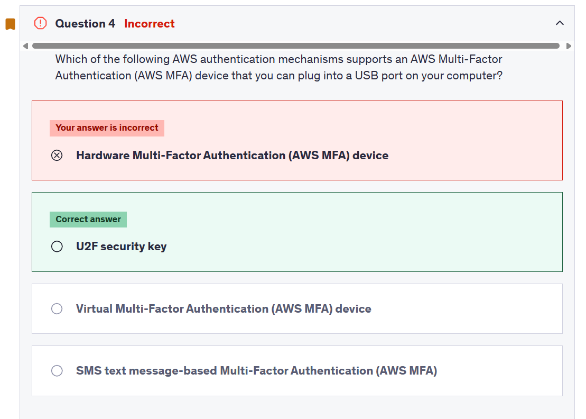

# Exam Summary

## ❌ Q4



```md
U2F security key

Universal 2nd Factor (U2F) Security Key is a device that you can plug into a USB port on your computer. U2F is an open authentication standard hosted by the FIDO Alliance. When you enable a U2F security key, you sign in by entering your credentials and then tapping the device instead of manually entering a code.

How to enable the U2F Security Key for your own IAM user:
```
