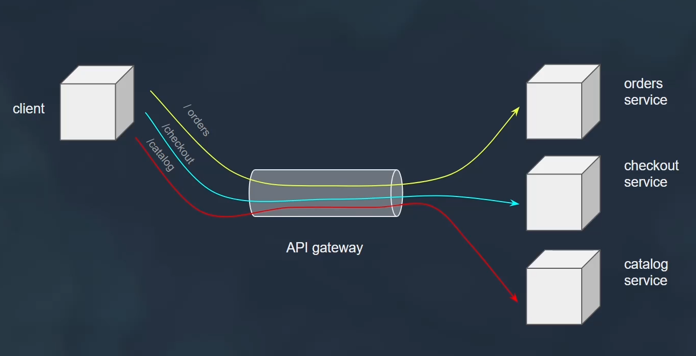
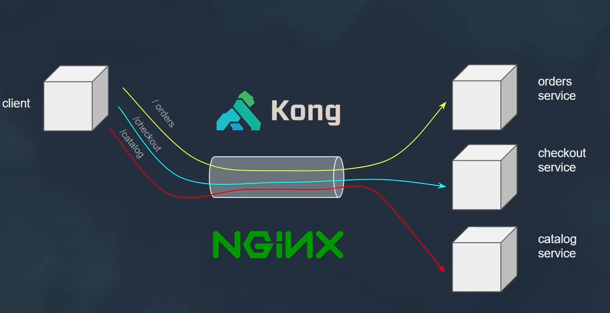
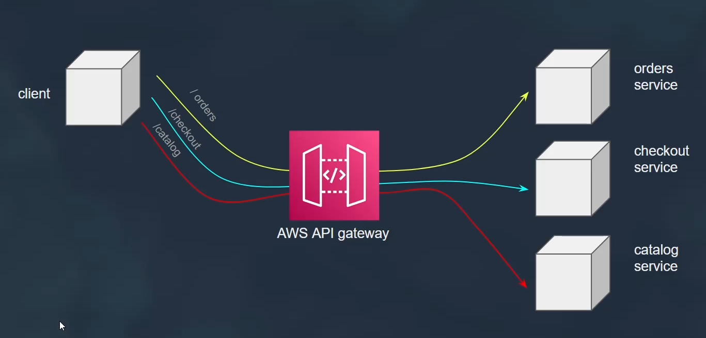
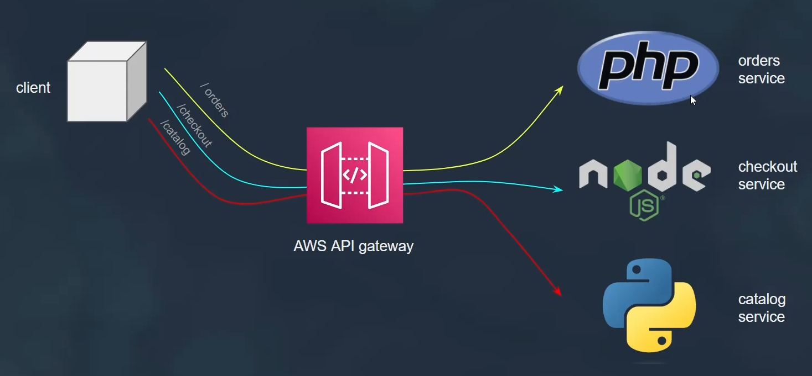
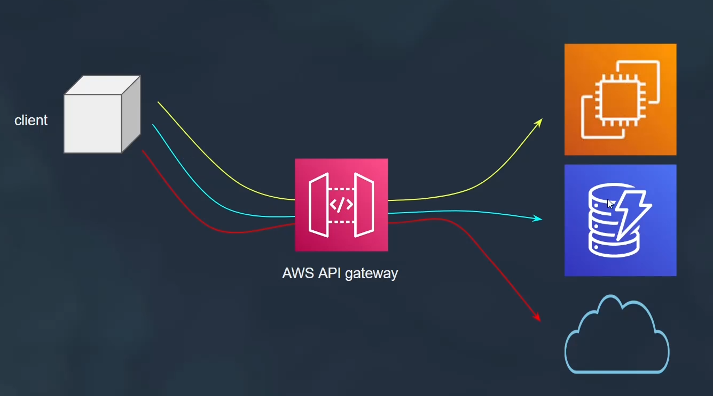
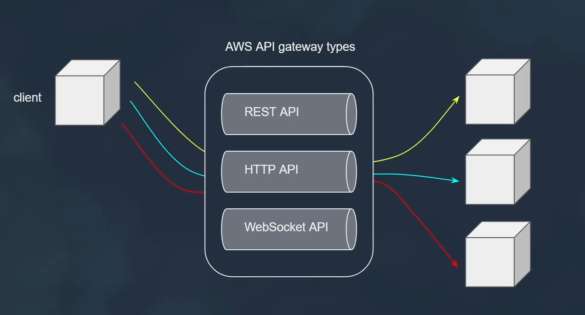
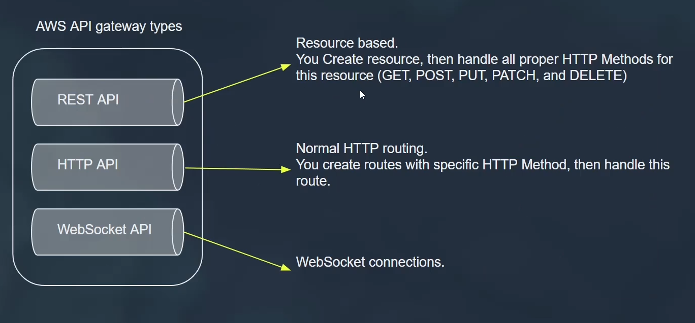
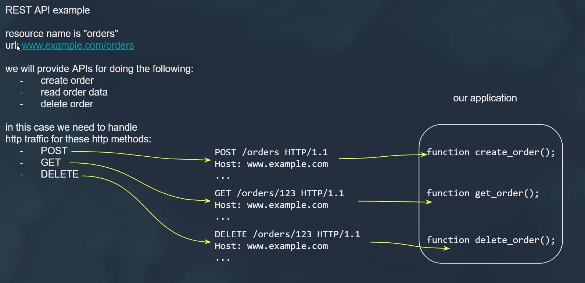
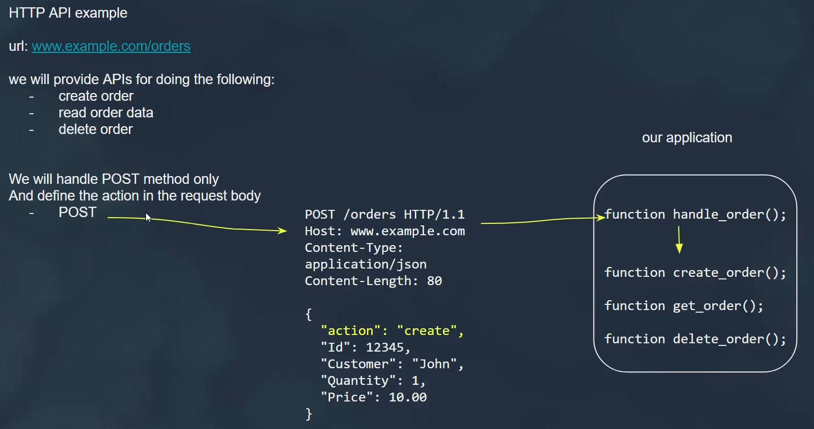

---
tags:
  - aws
aliases:
  - "AWS API Gateway"
  - "AWS API Getway"
---

# AWS API Gateway

    

    

    

    

    

    

    

    

    

---

## Related Notes
-[[aws-route53|AWS Route53]]] - next lesson
- [[aws-services/3.network/4.api-gateway/2.1.agw-rest-api|AWS API Gateway]] - mentions AWS API Gateway
- [[aws-services/3.network/4.api-gateway/x.api-gateway|Amazon API Gateway Streamlining API Management]] - mentions API Gateway
- [[aws-services/3.network/4.api-gateway/1.1.api-gateway|AWS API Gateway The Front Door for Your APIs]] - mentions API Gateway

---
